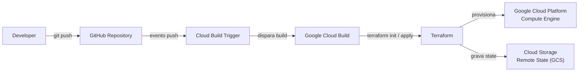
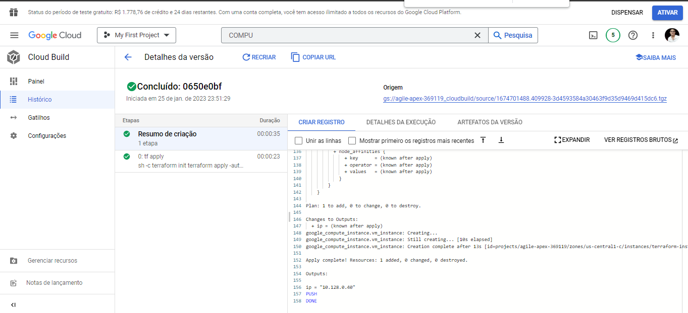
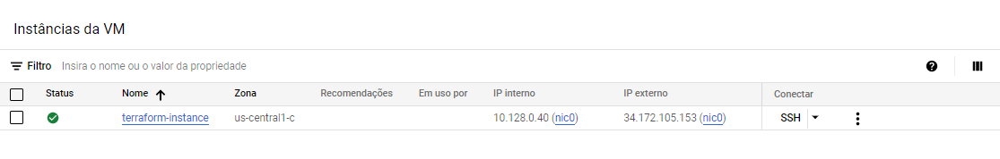
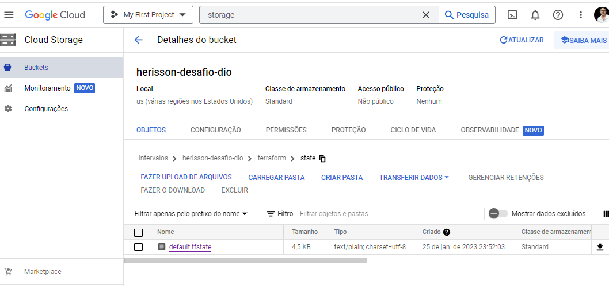
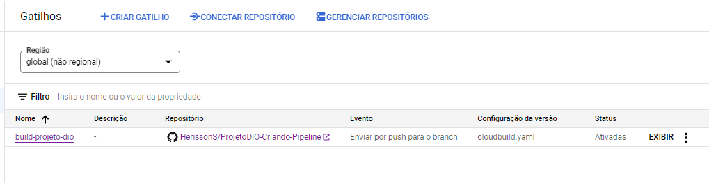
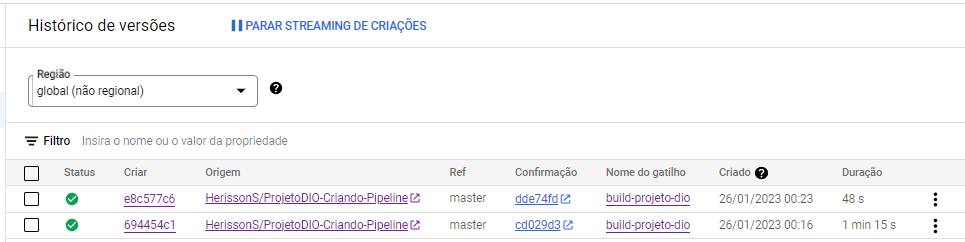
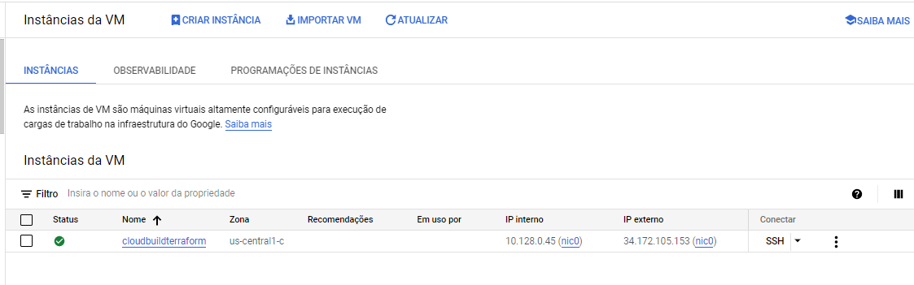

# ☁️ Pipeline de Infraestrutura na GCP com Cloud Build & Terraform


**Projeto acadêmico** desenvolvido durante o bootcamp da [Digital Innovation One (DIO)](https://www.dio.me/), com o objetivo de automatizar o provisionamento de infraestrutura no Google Cloud Platform (GCP) utilizando **Terraform** como Infrastructure as Code e **Google Cloud Build** como serviço de execução da pipeline.

## 📌 Sumário

- [📖 Sobre o Projeto](#-sobre-o-projeto)
- [🎯 Objetivo](#-objetivo)
- [🏗️ Arquitetura](#-arquitetura)
- [⚙️ Funcionamento](#-funcionamento)
- [🧱 Infrastructure as Code com Terraform](#-infrastructure-as-code-com-terraform)
- [☁️ Google Cloud Build](#-google-cloud-build)
- [💾 Terraform Remote State](#-terraform-remote-state)
- [📂 Estrutura do Repositório](#-estrutura-do-repositório)
- [📸 Evidências da Implementação](#-evidências-da-implementação)
- [🧠 Conceitos Praticados](#-conceitos-praticados)
- [🔐 Considerações de Segurança](#-considerações-de-segurança)
- [🔮 Possíveis Evoluções](#-possíveis-evoluções)
- [📚 Contexto Acadêmico](#-contexto-acadêmico)

## 📖 Sobre o Projeto

Este repositório documenta um projeto acadêmico criado durante os estudos na **DIO**, no desafio **"Criando Pipeline de CI/CD com Cloud Build e Terraform"**. O objetivo era dar os primeiros passos práticos em **Infrastructure as Code (IaC)** e automação de infraestrutura em nuvem.

A infraestrutura é descrita com **Terraform**, versionada como código no **GitHub** e provisionada de forma automatizada no **GCP** pelo **Google Cloud Build**, disparado por um **Cloud Build Trigger** vinculado ao repositório.

O ponto central do projeto é demonstrar, na prática, que uma alteração no código Terraform enviada ao repositório é capaz de alterar a infraestrutura real na GCP **sem intervenção manual** — confirmado pelo histórico de execuções e pelas evidências registradas neste documento.

## 🎯 Objetivo

Resolver, de forma automatizada e reproduzível, o problema do provisionamento manual de infraestrutura:

- Criar uma instância de máquina virtual (**Compute Engine**) na GCP a partir de código;
- Versionar a definição da infraestrutura junto com o código-fonte;
- Acionar a criação e a atualização da infraestrutura automaticamente a cada `push` no repositório;
- Manter o estado do Terraform armazenado de forma remota e centralizada no **Cloud Storage**.

## 🏗️ Arquitetura

O fluxo completo da solução, do desenvolvedor até a infraestrutura provisionada:



## ⚙️ Funcionamento

1. O desenvolvedor altera o código Terraform (por exemplo, o nome da instância);
2. As alterações são enviadas ao repositório via `git push`;
3. O **Cloud Build Trigger** detecta o `push` e inicia uma execução do **Cloud Build**;
4. O **Cloud Build** executa o passo definido em `cloudbuild.yaml`:
   - `terraform init` — baixa os providers e configura o backend remoto;
   - `terraform apply -auto-approve` — aplica as alterações na infraestrutura;
5. O **Terraform** atualiza o estado remoto no **Cloud Storage**;
6. A infraestrutura provisionada passa a refletir as alterações aplicadas.

## 🧱 Infrastructure as Code com Terraform

O **Terraform** é a ferramenta de IaC utilizada para declarar e provisionar a infraestrutura. A declaração é feita em linguagem **HCL**, de forma declarativa: o código descreve o estado desejado e o Terraform calcula as ações necessárias para alcançá-lo.

### Recursos declarados em `main.tf`

| Recurso | Detalhes |
|---|---|
| `google_compute_instance.vm_instance` | Instância de máquina virtual |
| └ `name` | `cloudbuildterraform` |
| └ `machine_type` | `f1-micro` (gratuita, uso em camada gratuita) |
| └ `boot_disk` | Imagem `debian-cloud/debian-11` |
| └ `network_interface` | Rede `default`, com `access_config` (IP público efêmero) |
| └ `tags` | `["prod"]` |
| └ `labels` | `centro_custo` definida via variável |

### Variáveis (`variables.tf`)

| Variável | Tipo | Default | Uso |
|---|---|---|---|
| `network_name` | `string` | `default` | Declarada, porém não referenciada em `main.tf` |
| `centro_custo_rh` | `string` | `rh` | Aplicada no label `centro_custo` da instância |

### Outputs (`outputs.tf`)

| Output | Valor |
|---|---|
| `ip` | Endereço IP interno da instância (`network_ip`) |

### Provider e configuração

- **Provider:** `hashicorp/google` (sem pinagem de versão);
- **Projeto:** `agile-apex-369119`;
- **Região / Zona:** `us-central1` / `us-central1-c`;
- **Backend:** `gcs` (estado remoto no Cloud Storage).

## ☁️ Google Cloud Build

O **Google Cloud Build** é o serviço gerenciado do GCP usado para executar a automação. Ele recebe a configuração da pipeline e executa as etapas em contêineres.

Conteúdo real de `cloudbuild.yaml`:

| Configuração | Valor |
|---|---|
| `steps[0].id` | `tf apply` |
| `steps[0].name` | `hashicorp/terraform:1.0.0` |
| `steps[0].entrypoint` | `sh` |
| Comandos | `terraform init` → `terraform apply -auto-approve` |
| `options.logging` | `CLOUD_LOGGING_ONLY` (logs no Cloud Logging) |

Observações técnicas sobre a pipeline real:

- A pipeline possui **um único passo**, que chama o Terraform;
- Não há etapa de `plan` nem de aprovação humana — o `apply -auto-approve` executa diretamente;
- Não há `substitutions`, artefatos ou etapas de *build*/*test* de aplicação;
- Não há `git push` de artefatos ou outras interações externas — a única ação é o provisionamento via Terraform.

Trata-se de uma **pipeline de automação de infraestrutura (Continuous Deployment de IaC)**.

## 💾 Terraform Remote State

Em `main.tf`, o bloco `backend "gcs"` configura o armazenamento remoto do estado do Terraform:

```hcl
backend "gcs" {
  bucket = "herisson-desafio-dio"
  prefix = "terraform/state"
}
```

Assim, o arquivo de estado (`terraform.tfstate`) fica no **Cloud Storage**, e não na máquina local. Benefícios práticos demonstrados pelo projeto:

- **Persistência:** o estado sobrevive à máquina local do desenvolvedor;
- **Centralização:** existe uma única fonte de verdade para a infraestrutura;
- **Compartilhamento:** viabiliza que outras pessoas/ferramentas operem sobre a mesma infraestrutura;
- **Separação:** o estado não fica acoplado a nenhum ambiente local.

O backend **GCS** do Terraform possui suporte nativo a *state locking* (controle de concorrência entre execuções), embora essa capacidade específica não seja evidenciada neste projeto — as evidências demonstram a persistência do arquivo de estado no bucket.

## 📂 Estrutura do Repositório

```
ProjetoDIO-Criando-Pipeline/
├── docs/
│   └── images/
│       ├── 01-cloud-build-executado.png
│       ├── 02-instancia-criada.png
│       ├── 03-terraform-state-cloud-storage.png
│       ├── 04-cloud-build-trigger.png
│       ├── 05-trigger-executado.png
│       └── 06-instancia-atualizada.png
├── cloudbuild.yaml          # Configuração da pipeline do Cloud Build
├── main.tf                  # Backend, provider e recursos do Terraform
├── outputs.tf               # Outputs do Terraform
├── variables.tf             # Variáveis do Terraform
├── .gitignore               # Arquivos locais do Terraform ignorados
└── README.md
```

## 📸 Evidências da Implementação

As capturas de tela abaixo documentam a execução real do projeto, em ordem lógica.

### 1. Execução inicial do Cloud Build



Registro da primeira execução da pipeline no Cloud Build, aplicando a infraestrutura com o Terraform.

### 2. Instância provisionada pelo Terraform



Instância de máquina virtual criada na GCP pelo `terraform apply`, listada no Compute Engine.

### 3. Terraform State armazenado no Cloud Storage



Arquivo de estado do Terraform persistido no bucket `herisson-desafio-dio` do Cloud Storage, dentro do prefixo `terraform/state`.

### 4. Trigger integrado ao repositório



Cloud Build Trigger criado e vinculado ao repositório no GitHub, responsável por iniciar a pipeline a cada `push`.

### 5. Execução automática após alteração



Execução automática da pipeline disparada pelo trigger após uma alteração ser enviada ao repositório.

### 6. Infraestrutura atualizada



Instância refletindo a atualização aplicada pelo Terraform (`cloudbuildterraform`), confirmando o ciclo de IaC: **código alterado → push → trigger → Cloud Build → Terraform → infraestrutura atualizada**.

## 🧠 Conceitos Praticados

- **Infrastructure as Code (IaC)** — infraestrutura definida como código versionável;
- **Terraform / HCL** — linguagem declarativa de infraestrutura;
- **Declarative Infrastructure** — código descreve o estado desejado, não os passos;
- **Terraform State & Remote State** — persistência centralizada do estado;
- **Variáveis e Outputs** — parametrização e exposição de dados da infraestrutura;
- **Provider Google Cloud** — integração do Terraform com a GCP;
- **Google Cloud Platform** — Compute Engine, Cloud Storage e Cloud Build;
- **Automação baseada em eventos** — `git push` aciona a execução automática;
- **Integração GitHub + GCP** — repositório conectado à nuvem via Cloud Build Trigger;
- **Provisionamento automatizado** — criação e atualização de infraestrutura sem ação manual.

## 🔐 Considerações de Segurança

O projeto foi criado em contexto acadêmico e deve ser compreendido como tal.

### IMPLEMENTADO

- **Backend remoto (GCS):** o estado do Terraform não fica armazenado na máquina local;
- **Sem credenciais versionadas:** nenhuma chave de Service Account, token ou segredo foi encontrada nos arquivos do git;
- **Logs do Cloud Build** direcionados ao Cloud Logging (`CLOUD_LOGGING_ONLY`).

## 📚 Contexto Acadêmico

Este projeto foi desenvolvido durante os estudos na **Digital Innovation One (DIO)**, no desafio **"Criando Pipeline de CI/CD com Cloud Build e Terraform"**. O desafio consistia em criar uma pipeline na GCP que, ao receber um `push` no repositório, provisionasse uma instância de máquina virtual via Terraform.

Trata-se de um exercício de **aprendizado prático**, não de uma solução de produção. Seu valor está na demonstração dos fundamentos de IaC e automação de infraestrutura em nuvem: um ponto de partida sólido para evoluir em direção a práticas de DevOps e DevSecOps.
